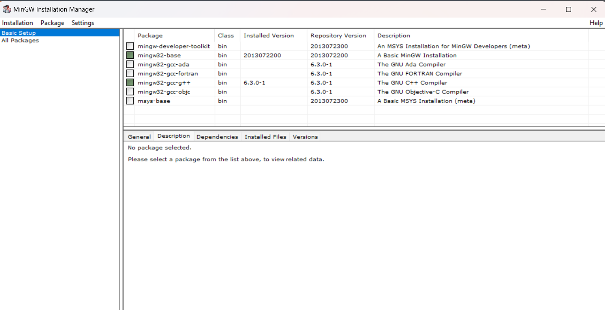
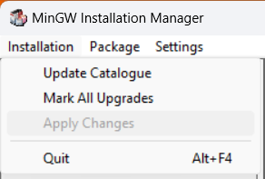

# EU-CARRINHO
## Projeto de Computação Gráfica - Universidade Federal de Sergipe

**Descrição:** Este projeto é parte da avaliação da disciplina de Computação Gráfica na UFS. O objetivo é criar um mini simulador de direção automobilística.

### Requisitos
- OpenGL
- FreeGlut
- MinGW

### Instruções de Execução

#### Windows:
1. **Instalação do MinGW:**
   - Baixe o MinGW em: sourceforge.net/projects/mingw-w64/
   - Siga as opções de instalação conforme as imagens de configuração.
   
   
   
   - Adicione o MinGW ao PATH do sistema:
     ```bash
     setx PATH "%PATH%;C:\MinGW\bin"
     ```
   - Instale o FreeGlut seguindo o tutorial disponível em: youtu.be/RozYV8JRJko

2. **Configuração do Projeto:**
   - Clone o repositório:
     ```bash
     git clone https://github.com/brenofaro/CG-Eu_carrinho.git
     ```
   - Entre na pasta do projeto:
     ```bash
     cd CG-Eu_carrinho
     ```
   - Compile e execute o projeto:
     ```bash
     mingw32-make run
     ```

#### Linux:
- **Instalação de Dependências:**
  - Se não tiver o FreeGlut e o compilador de C++ instalados, execute:
    ```bash
    sudo apt-get install freeglut3-dev build-essential
    ```

- **Configuração do Projeto:**
  - Clone o repositório e entre na pasta do projeto:
    ```bash
    git clone https://github.com/brenofaro/CG-Eu_carrinho.git
    cd CG-Eu_carrinho
    ```
  - Compile e execute o projeto com:
    ```bash
    make run
    ```
